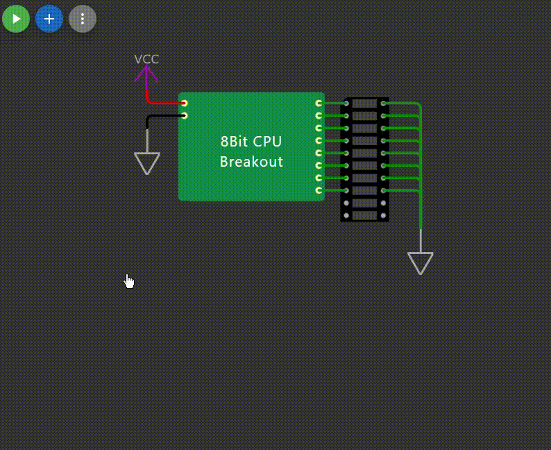

# 8-Bit CPU
This project implements a simplified 8-bit CPU architecture in C, It serves as an educational tool for understanding computer architecture, instruction sets, and low-level programming.

This project is based on [8-Bit CPU](https://github.com/Empitrix/8bitcpu), which is made only in [Wokwi](https://wokwi.com/) environment.

## Preview

See [8-Bit CPU in Wokwi](https://wokwi.com/projects/407516594168213505).

